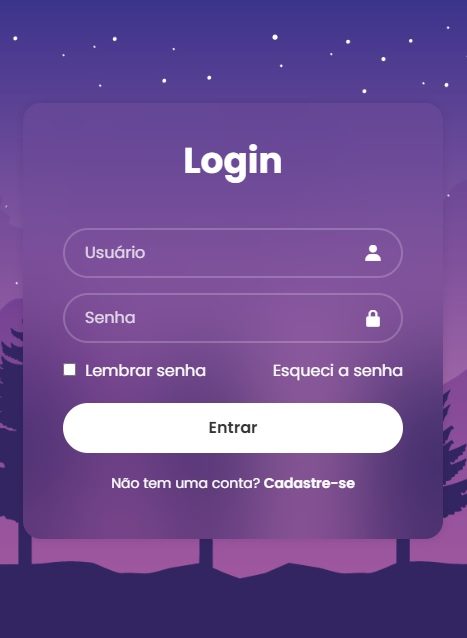

# 🔐 Tela de Login Responsiva

Este projeto é uma interface de login moderna e responsiva, desenvolvida como parte de um estudo prático de desenvolvimento web front-end.

## 📸 Demonstração

  

## 🚀 Tecnologias Utilizadas

* **HTML5**: Estruturação semântica.
* **CSS3**: Estilização, Flexbox e responsividade.
* **Boxicons**: Biblioteca de ícones.

## 📚 Créditos e Referências

O design e a estrutura inicial deste projeto foram desenvolvidos acompanhando a aula do professor **Rodolfo Mori**:
* **Canal:** [DevClub](https://www.youtube.com/@canaldevclub)
* **Vídeo:** [Projeto Tela de Login com HTML e CSS](https://www.youtube.com/watch?v=pXAGoP2G2vE)

## 🛠️ Funcionalidades Extra (Em implementação)

Para expandir o conhecimento além do tutorial, estou implementando as seguintes funcionalidades em **JavaScript**:
- [x] Validação de campos obrigatórios (E-mail e Senha).
- [ ] Alternar visibilidade da senha (Mostrar/Esconder).
- [ ] Armazenamento local para a função "Lembrar senha".

---
### ✒️ Autor
Desenvolvido por **Josiane Alves** - Estudante de ADS.

---

## 📫 Vamos nos conectar?

Gostou do projeto? Sinta-se à vontade para entrar em contato ou acompanhar meus estudos:

  
  
  

---
